# VietCropDoctor

Hệ thống chẩn đoán bệnh cây trồng bằng AI, phục vụ nông dân Việt Nam.

Người dùng chụp ảnh lá cây và tải lên hệ thống. Vision-AI phân loại bệnh bằng ensemble 5 mô hình deep learning, RAG Engine tra cứu tài liệu nông nghiệp tiếng Việt liên quan, sau đó LLM tổng hợp thành khuyến nghị xử lý dễ hiểu. Toàn bộ pipeline chạy local, không phụ thuộc API AI trả phí của bên thứ ba.

Đồ án tốt nghiệp — tập trung vào ba mảng kỹ thuật chính: Computer Vision (phân loại bệnh), Retrieval-Augmented Generation (tra cứu tri thức nông nghiệp), và kiến trúc microservice sản xuất (event-driven, observability, MLOps).

---

## Mục lục

- [Kiến trúc hệ thống](#kiến-trúc-hệ-thống)
- [Dataset](#dataset)
- [Computer Vision — Vision-AI](#computer-vision--vision-ai)
- [Retrieval-Augmented Generation — RAG Engine](#retrieval-augmented-generation--rag-engine)
- [Orchestrator — Multi-agent reasoning](#orchestrator--multi-agent-reasoning)
- [Auth & RBAC](#auth--rbac)
- [Cấu trúc thư mục](#cấu-trúc-thư-mục)
- [Công nghệ sử dụng](#công-nghệ-sử-dụng)
- [Khởi động nhanh](#khởi-động-nhanh)
- [Biến môi trường quan trọng](#biến-môi-trường-quan-trọng)
- [Kafka topics](#kafka-topics)
- [Giám sát](#giám-sát)
- [Giao diện](#giao-diện)
- [Trạng thái implement](#trạng-thái-implement)

---

## Kiến trúc hệ thống

Client gọi qua Gateway (Nginx), Gateway xác thực JWT thông qua Auth Service rồi chuyển tiếp vào Orchestrator. Orchestrator điều phối tuần tự Vision-AI, RAG Engine và LLM (Ollama) để tạo phản hồi cuối cùng. Mọi sự kiện chẩn đoán được đẩy qua Kafka để Analytics ghi vào ClickHouse, phục vụ dashboard Grafana và trigger retrain tự động qua Airflow.

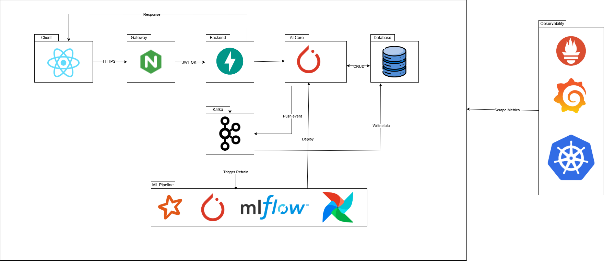

```
Client (React 19)
    │  HTTPS
    ▼
Gateway (Nginx :8000)
    │  auth_request → Auth Service (:8005)
    │  JWT hợp lệ
    ▼
Orchestrator (:8006)
    │
    ├─► Vision-AI (:8001)   ensemble 5 model, MC Dropout, OOD detection
    ├─► RAG Engine (:8002)  Qdrant + BM25 hybrid + cross-encoder reranking
    └─► Ollama (:11434)     qwen2.5, chạy local

Vision-AI / RAG ──► Kafka ──► Analytics (:8004) ──► ClickHouse

ML Pipeline:   Airflow → PySpark → PyTorch → MLflow → hot-swap model vào Vision-AI
Observability: Prometheus ← scrape ← toàn bộ service
               Grafana ← đọc ← Prometheus
```

Sơ đồ chi tiết hơn (thành phần nội bộ từng service, luồng dữ liệu):

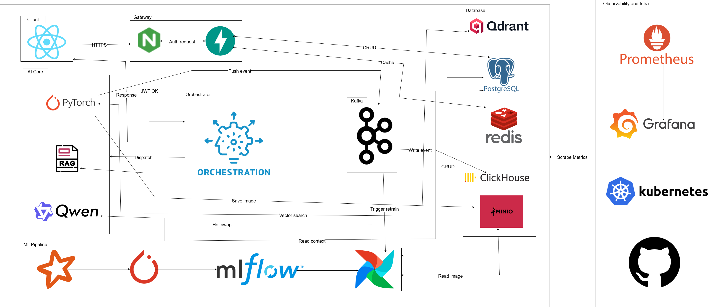

### Các cụm dịch vụ

| Cụm           | Service                                          | Port        |
| ------------- | ------------------------------------------------- | ----------- |
| Client        | React 19 + Vite + TailwindCSS                      | 3000        |
| Gateway       | Nginx — reverse proxy, rate limit, SSL             | 8000        |
| Gateway       | Auth Service — JWT, bcrypt, RBAC 3 cấp             | 8005        |
| Orchestrator  | FastAPI — multi-agent reasoning chain              | 8006        |
| AI Core       | Vision-AI — ensemble 5 model, MC Dropout, OOD       | 8001        |
| AI Core       | RAG Engine — Qdrant + BM25 hybrid + reranking       | 8002        |
| AI Core       | Ollama — qwen2.5 (LLM local)                       | 11434       |
| Messaging     | Apache Kafka + Zookeeper                           | 9092        |
| Database      | Qdrant — vector database                           | 6333        |
| Database      | PostgreSQL — users, chat history, feedback         | 5432        |
| Database      | Redis — JWT cache, session, rate limit             | 6379        |
| Database      | ClickHouse — OLAP analytics                        | 8123        |
| Database      | MinIO — ảnh upload, model checkpoint               | 9001 / 9002 |
| ML Pipeline   | PySpark → PyTorch → MLflow → Airflow               | —           |
| Observability | Prometheus + Grafana                               | 9090 / 3001 |

---

## Dataset

Dataset phân loại bệnh gồm **25 lớp** (24 lớp bệnh + lớp khỏe mạnh cho mỗi loại cây), tổng cộng **26.795 ảnh**, tổng hợp từ nhiều nguồn công khai (Roboflow, Mendeley Data, Kaggle, PlantVillage) cho 4 loại cây trồng phổ biến ở Việt Nam.

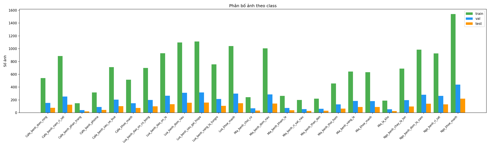

| Cây trồng | Số lớp | Danh sách bệnh |
| --------- | ------ | -------------- |
| Cà phê    | 6      | Lá khỏe mạnh, sâu vẽ bùa, phoma (thối chồi), phấn trắng, nấm rỉ sắt, đốm rong |
| Lúa       | 6      | Lúa khỏe mạnh, đốm nâu, sâu gai, vàng lá tungro, đạo ôn lá, đạo ôn cổ bông |
| Mía       | 9      | Lá khỏe mạnh, lá khô, chồi cỏ, đốm nâu, khảm lá, rỉ sắt nâu, than đen, thối hom, vàng lá |
| Ngô       | 4      | Ngô khỏe mạnh, cháy lá lớn, rỉ sắt, đốm lá xám |

Đặc điểm dữ liệu:

- Đã chia sẵn train / validation / test, mỗi split đều đủ 25 class.
- Phân bố lớp không cân bằng (class imbalance) — được bù bằng augmentation và trọng số loss khi train.
- Kích thước ảnh không đồng nhất giữa các nguồn, cần resize và chuẩn hóa trước khi đưa vào model.
- Pipeline tiền xử lý dùng PySpark (`ml/preprocessing/`) để xử lý song song ở quy mô lớn, lọc ảnh lỗi và chia lại split khi có dữ liệu mới.

Tài liệu tri thức nông nghiệp (phục vụ RAG) là các văn bản kỹ thuật tiếng Việt về triệu chứng, nguyên nhân và cách xử lý từng loại bệnh, được ingest vào Qdrant thông qua pipeline chunking mô tả ở phần RAG bên dưới.

---

## Computer Vision — Vision-AI

Vision-AI nhận ảnh lá cây, chạy song song 5 kiến trúc deep learning khác nhau và tổng hợp kết quả bằng weighted soft-voting, kèm theo ước lượng độ bất định và phát hiện ảnh ngoài phân phối (không phải lá cây).

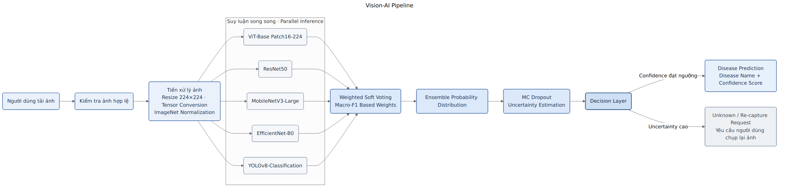

### Ensemble 5 model

| Model             | Kiến trúc                          |
| ----------------- | ----------------------------------- |
| EfficientNet-B0    | torchvision CNN                     |
| MobileNetV3-Large  | torchvision CNN                     |
| ResNet50           | torchvision CNN                     |
| ViT                | Vision Transformer (HuggingFace)    |
| YOLOv8-cls         | Ultralytics YOLO classifier         |

Mỗi model được nạp một lần khi khởi động và chạy song song qua `ThreadPoolExecutor`. Vì các model có thể được train với thứ tự nhãn khác nhau, hệ thống reindex xác suất đầu ra của từng model về một thứ tự class chuẩn (canonical order) trước khi gộp — tránh lỗi cộng nhầm xác suất của hai nhãn khác nhau.

Công thức weighted soft-voting:

```
P_ensemble(c) = Σ w_i · P_i(c)          với  Σ w_i = 1
```

Trọng số `w_i` của mỗi model bằng val_accuracy đo được trong quá trình train, log lại trong MLflow rồi chuẩn hóa (renormalize) để tổng bằng 1. Kết quả cuối gồm: nhãn bệnh top-1, top-3 kèm confidence, dự đoán riêng của từng model, và `agreement_score` — tỷ lệ số model đồng ý với nhãn top-1 (dùng để đánh giá độ tin cậy của kết quả).

### Ước lượng độ bất định — Monte Carlo Dropout

Khi có ít nhất một model dạng PyTorch trong ensemble, hệ thống chạy thêm 5 lượt forward pass với các lớp Dropout được bật ở chế độ train (thay vì tắt như lúc inference bình thường), giữ nguyên BatchNorm ở chế độ eval. Phương sai giữa các lượt phản ánh độ bất định epistemic của model.

`uncertainty_score` là entropy chuẩn hóa của xác suất trung bình:

```
H = -Σ p(c) · log(p(c))
uncertainty_score = H / log(num_classes)   ∈ [0, 1]
```

0 nghĩa là model rất tự tin, 1 nghĩa là model không phân biệt được giữa các lớp.

### Phát hiện ảnh ngoài phân phối (OOD)

Bên cạnh softmax probability, hệ thống tính thêm **energy score** (`-logsumexp` trên logits trung bình có trọng số của các model lộ ra logits). Energy score thấp bất thường là dấu hiệu ảnh đầu vào không thuộc phân phối dữ liệu huấn luyện — ví dụ người dùng tải lên ảnh không phải lá cây. Khi phát hiện OOD, Orchestrator dừng sớm (early stop), bỏ qua bước retrieval và LLM, trả về thẳng thông báo hướng dẫn thay vì một kết quả chẩn đoán sai.

### Kết quả huấn luyện

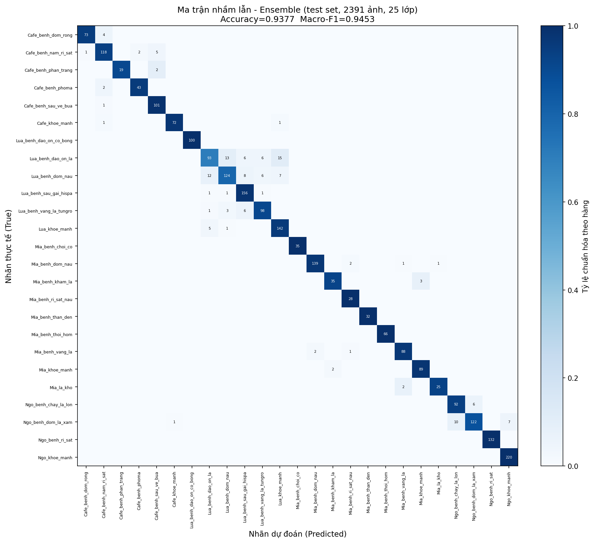

<table>
<tr>
<td>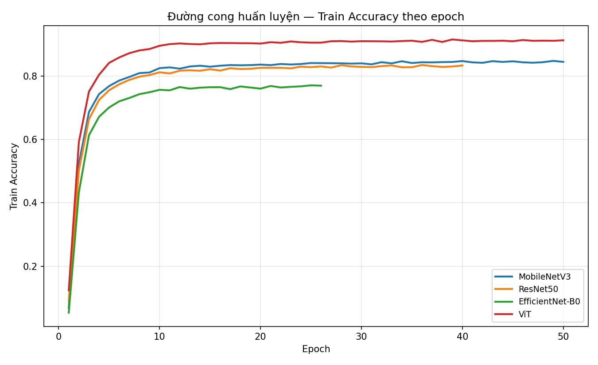</td>
<td>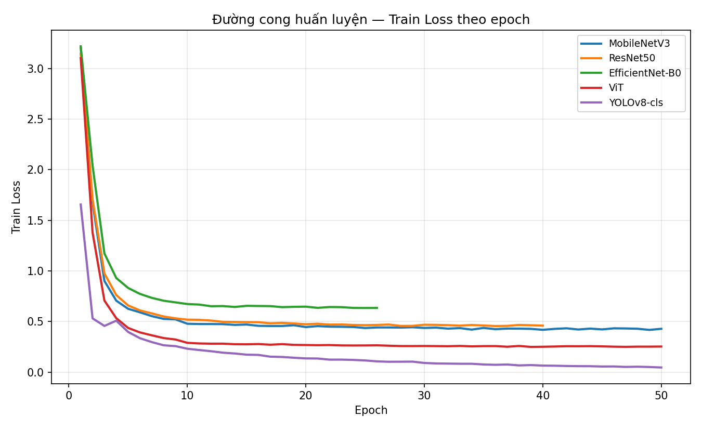</td>
</tr>
</table>

---

## Retrieval-Augmented Generation — RAG Engine

RAG Engine tra cứu tài liệu nông nghiệp tiếng Việt liên quan đến bệnh đã chẩn đoán, rồi cấp ngữ cảnh đó cho LLM sinh khuyến nghị xử lý. Điểm mạnh của thiết kế là **hybrid search** kết hợp dense retrieval (ngữ nghĩa) với BM25 (từ khóa chính xác), qua đó xử lý tốt cả câu hỏi diễn đạt tự nhiên lẫn câu hỏi gõ đúng thuật ngữ kỹ thuật.

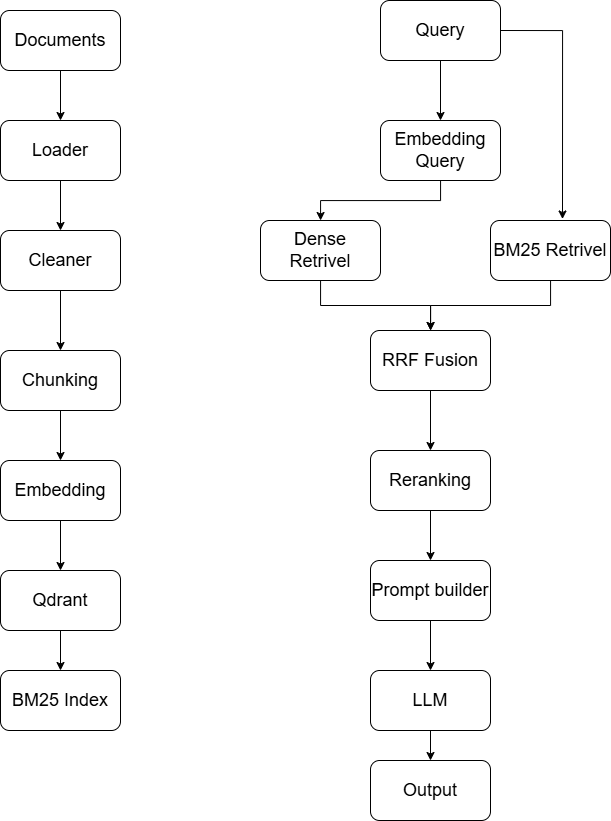

### Ingestion — chunking tài liệu

Văn bản được chia nhỏ bằng thuật toán đệ quy (tương đương `RecursiveCharacterTextSplitter` của LangChain nhưng tự viết, không phụ thuộc thư viện ngoài): thử tách theo đoạn văn trước, nếu đoạn vẫn quá dài thì tách theo dòng, theo dấu câu, theo dấu phẩy, theo khoảng trắng, và cuối cùng là cắt cứng theo ký tự nếu không còn cách nào khác. Mỗi chunk (mặc định 512 ký tự, overlap 64 ký tự) giữ lại `chunk_id` xác định (deterministic, tính từ SHA-256 của đường dẫn nguồn + vị trí + nội dung), nên ingest lại cùng một file không tạo vector trùng lặp trong Qdrant.

### Embedding

Model `intfloat/multilingual-e5-base` — 768 chiều, cosine similarity, hỗ trợ tiếng Việt. Model này yêu cầu prefix riêng cho câu hỏi (`"query: "`) và tài liệu (`"passage: "`) để đúng ngữ nghĩa huấn luyện. Có LRU cache để tránh embed lại các đoạn văn bản đã xử lý.

### Hybrid retrieval — Reciprocal Rank Fusion

Dense retrieval (Qdrant, lọc theo metadata loại cây/bệnh) và BM25 retrieval (khớp từ khóa, không lọc metadata) chạy song song, sau đó gộp kết quả bằng công thức RRF (Cormack et al., 2009):

```
score(d) = α · 1/(k + rank_dense(d))  +  (1 − α) · 1/(k + rank_bm25(d))
```

với `k = 60`, `α = 0.7` (ưu tiên dense hơn BM25 theo mặc định), `rank` đánh số từ 1. Một chunk chỉ xuất hiện ở một phía vẫn được tính điểm — không bị phạt vì "vắng mặt" ở phía còn lại, chỉ đơn giản là không có thêm bằng chứng từ phía đó.

### Reranking

Danh sách sau fusion được chấm điểm lại bằng cross-encoder `cross-encoder/mmarco-mMiniLMv2-L12-H384-v1` (đa ngôn ngữ, ~117M tham số, chạy trên CPU để dành VRAM cho LLM). Cross-encoder chấm từng cặp (câu hỏi, đoạn văn) chính xác hơn nhiều so với so khớp vector rời rạc, vì mô hình nhìn thấy đồng thời cả hai bên. Reranker có thể tắt qua config; khi tắt, thứ tự retrieval được giữ nguyên.

### Sinh câu trả lời

Ngữ cảnh sau rerank được đưa vào prompt cùng câu hỏi, lịch sử hội thoại (tối đa 5 lượt gần nhất) và tên bệnh đã chẩn đoán, sau đó LLM (Ollama, chạy local) sinh câu trả lời bằng tiếng Việt.

---

## Orchestrator — Multi-agent reasoning

Orchestrator điều phối 4 agent chạy tuần tự, mỗi agent nhận và trả về một `context` dùng chung:

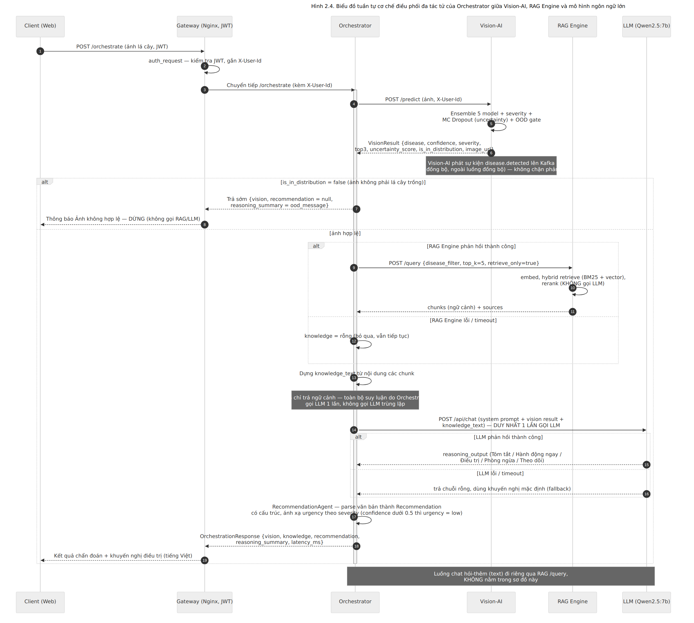

```
VisionAgent → RetrievalAgent → LLM Reasoning → RecommendationAgent
```

1. **VisionAgent** — gửi ảnh sang Vision-AI, nhận về bệnh, confidence, độ bất định và cờ OOD. Nếu ảnh được xác định là ngoài phân phối (không phải lá cây), chain dừng sớm ngay tại đây và trả về thông báo hướng dẫn, không tốn thời gian gọi RAG hay LLM cho một chẩn đoán vô nghĩa.
2. **RetrievalAgent** — gọi RAG Engine ở chế độ `retrieve_only`, lấy về các đoạn tài liệu liên quan đến bệnh đã phát hiện mà không sinh câu trả lời (tránh gọi LLM hai lần trong cùng một request).
3. **LLM Reasoning** — ghép bệnh, độ nghiêm trọng và ngữ cảnh tri thức thành một prompt duy nhất, gọi LLM sinh phần lý giải.
4. **RecommendationAgent** — chuẩn hóa đầu ra thành khuyến nghị xử lý có cấu trúc trả về cho client.

Toàn bộ latency của từng bước (`vision_ms`, `retrieve_ms`, `llm_ms`, `total_ms`) được đo và trả kèm response, phục vụ dashboard AI Performance trên Grafana.

---

## Auth & RBAC

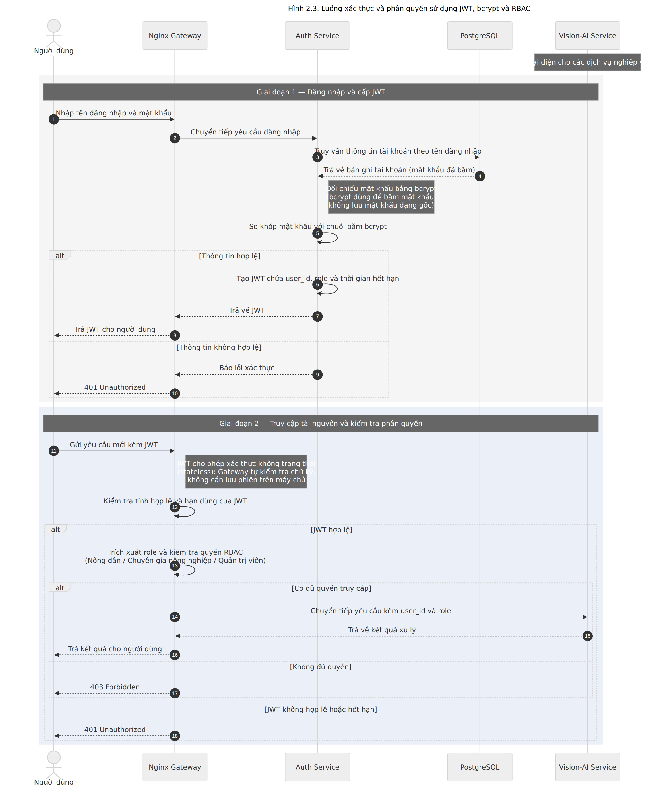

Auth Service phát hành JWT sau khi xác thực bằng bcrypt, RBAC chia 3 cấp quyền:

| Vai trò    | Quyền hạn                                                          |
| ---------- | -------------------------------------------------------------------- |
| farmer     | Tài khoản mặc định khi tự đăng ký — chẩn đoán ảnh, chat, xem lịch sử |
| agronomist | Chuyên gia nông nghiệp — duyệt/phản hồi chẩn đoán, quản lý tri thức  |
| admin      | Toàn quyền — quản lý user, xem dashboard, trigger retrain model      |

Tài khoản tự đăng ký công khai luôn được tạo với vai trò `farmer`; việc cấp quyền `agronomist` hoặc `admin` chỉ thực hiện qua route quản trị dành riêng cho admin, không có cách nào để client tự đặt role khi đăng ký.

Sơ đồ quan hệ dữ liệu (ERD):

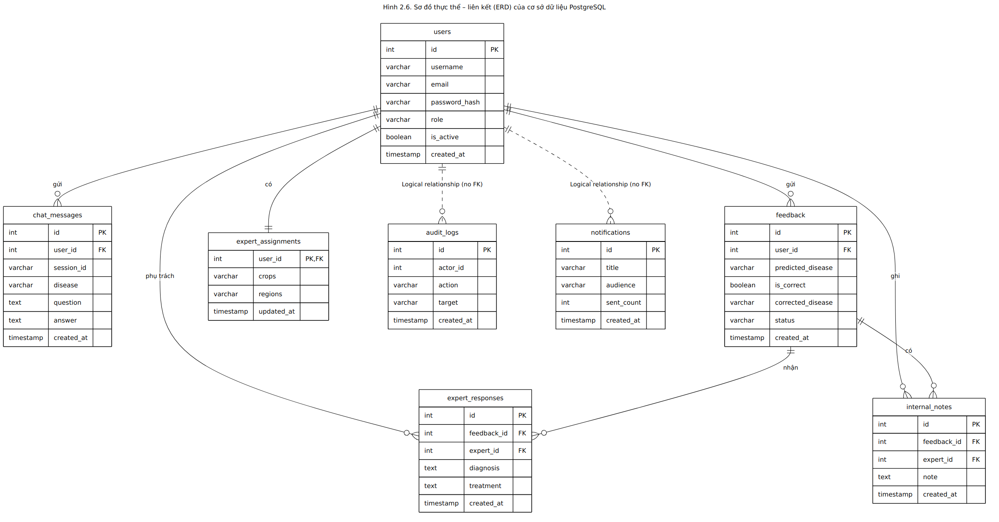

RAG Engine dùng Qdrant làm vector store cho toàn bộ tri thức nông nghiệp:

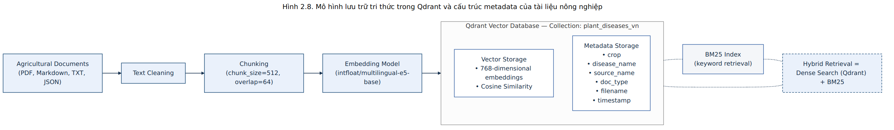

---

## Cấu trúc thư mục

```
datn/
├── backend/
│   ├── services/
│   │   ├── gateway/                  Nginx reverse proxy
│   │   ├── core/auth/                Auth Service :8005
│   │   ├── ai/vision-ai/             Vision-AI :8001 (ensemble, MC Dropout, OOD)
│   │   ├── ai/rag-engine/            RAG Engine :8002 (hybrid search, rerank)
│   │   ├── ai/orchestrator/          Orchestrator :8006 (4-agent chain)
│   │   └── platform/analytics/       Analytics :8004 (Kafka consumer)
│   └── shared/                       Package vcd_shared dùng chung
│
├── client/
│   ├── web/                          React 19 + Vite + TailwindCSS
│   └── shared-types/                 TypeScript interfaces dùng chung
│
├── ml/
│   ├── training/classification/      5 model: EfficientNet, MobileNetV3, ResNet50, YOLO, ViT
│   ├── preprocessing/                PySpark pipeline
│   ├── airflow/dags/                 ETL + retrain + ingest DAGs
│   ├── mlflow/                       Experiment tracking helpers
│   ├── feature-store/                Feast (online Redis + offline Parquet)
│   └── rag/                          Đánh giá RAG (RAGAS), tài liệu tri thức
│
├── infra/
│   ├── kubernetes/                   K8s manifests (kustomize)
│   ├── monitoring/                   Prometheus + Grafana
│   └── cicd/                         GitHub Actions workflows
│
├── icon/                             Ảnh minh họa dùng trong README
├── scripts/                          Script khởi động / dừng / ingest / seed model
├── docker-compose.yml
└── .env.example
```

---

## Công nghệ sử dụng

### Backend

| Thành phần       | Công nghệ                          |
| ----------------- | ------------------------------------ |
| Web framework      | FastAPI + Uvicorn                    |
| Message broker     | Apache Kafka + Zookeeper             |
| Vector database    | Qdrant                               |
| CSDL quan hệ       | PostgreSQL 16                        |
| Cache              | Redis 7                              |
| Analytics DB       | ClickHouse 24                        |
| Object storage     | MinIO                                |
| LLM inference      | Ollama — qwen2.5 (chạy local)        |
| API gateway        | Nginx                                |

### Machine Learning

| Thành phần         | Công nghệ                                                  |
| ------------------- | ------------------------------------------------------------ |
| Deep learning        | PyTorch 2 + torchvision                                      |
| Classification       | EfficientNet-B0, MobileNetV3-Large, ResNet50, YOLOv8-cls, ViT |
| Ensemble              | Weighted soft-voting theo val_accuracy (MLflow)               |
| Uncertainty           | Monte Carlo Dropout                                           |
| OOD detection         | Energy score trên logits trung bình                           |
| Embedding             | intfloat/multilingual-e5-base                                 |
| Reranking             | cross-encoder/mmarco-mMiniLMv2-L12-H384-v1                    |
| Hybrid retrieval      | Dense (Qdrant) + BM25, kết hợp bằng Reciprocal Rank Fusion    |
| Data pipeline         | PySpark (local[*])                                            |
| Feature store         | Feast (Redis online + Parquet offline)                        |
| Experiment tracking   | MLflow                                                        |
| Workflow              | Apache Airflow                                                |

### Frontend

| Thành phần | Công nghệ                    |
| ----------- | ------------------------------ |
| Web          | React 19 + Vite + TypeScript   |
| UI           | TailwindCSS 4 + shadcn/ui      |
| State        | Zustand                        |
| Routing      | React Router v6                |
| Real-time    | WebSocket                      |

### Hạ tầng

| Thành phần    | Công nghệ                          |
| -------------- | ------------------------------------ |
| Container       | Docker + Docker Compose              |
| Orchestration   | Kubernetes + Kustomize               |
| CI/CD           | GitHub Actions                       |
| Image registry  | GitHub Container Registry (ghcr.io)  |
| Monitoring      | Prometheus + Grafana                 |

---

## Khởi động nhanh

### Yêu cầu

- Docker Desktop 4.x trở lên, đang chạy
- RAM tối thiểu 8 GB, khuyến nghị 16 GB (Ollama chiếm khoảng 6 GB)
- Ổ cứng trống tối thiểu 20 GB (model LLM ~4.7 GB)
- GPU NVIDIA với CUDA 11.8 trở lên — tùy chọn, inference vẫn chạy được trên CPU

### Bước 1 — Cấu hình môi trường

```bash
cp .env.example .env
# Sửa 3 giá trị bắt buộc:
#   JWT_SECRET          — chuỗi ngẫu nhiên 64 ký tự
#   POSTGRES_PASSWORD   — mật khẩu mạnh
#   MINIO_ROOT_PASSWORD — mật khẩu mạnh
```

### Bước 2 — Khởi động

Windows:

```bat
scripts\start.bat
```

Linux / macOS:

```bash
chmod +x scripts/start.sh
./scripts/start.sh
```

Script tự động kiểm tra prerequisites, tạo thư mục data, khởi động hạ tầng theo đúng thứ tự phụ thuộc, kéo model Ollama (lần đầu mất 10–30 phút), khởi động các app service, rồi in bảng trạng thái.

### Bước 3 — Ingest tài liệu nông nghiệp (bắt buộc để RAG hoạt động)

```bash
./scripts/ingest-knowledge.sh
```

### Bước 4 — Seed model weights

```bash
./scripts/seed-models.sh
```

---

## Biến môi trường quan trọng

| Biến                              | Bắt buộc | Mô tả                                                                  |
| ----------------------------------- | ---------- | -------------------------------------------------------------------------- |
| `JWT_SECRET`                        | có         | Khóa ký JWT — dùng chuỗi ngẫu nhiên 64 ký tự                              |
| `POSTGRES_PASSWORD`                 | có         | Mật khẩu PostgreSQL                                                       |
| `MINIO_ROOT_PASSWORD`               | có         | Mật khẩu MinIO                                                            |
| `LLM_MODEL`                         | không      | Model Ollama, mặc định `qwen2.5:3b`, có thể đổi sang `qwen2.5:7b` nếu đủ VRAM |
| `SMTP_USER` / `SMTP_PASSWORD`       | không      | Chỉ cần khi bật cảnh báo qua email                                        |
| `SMS_API_KEY`                       | không      | Chỉ cần khi bật cảnh báo qua SMS                                          |

---

## Kafka topics

| Topic                | Publisher   | Consumer  | Mục đích                              |
| ---------------------- | ----------- | --------- | ---------------------------------------- |
| `disease.detected`    | Vision-AI   | Analytics | Ghi lại kết quả chẩn đoán ảnh           |
| `chat.requested`      | RAG Engine  | Analytics | Thống kê lượt hỏi đáp                   |
| `retrain.requested`   | Analytics   | Airflow   | Trigger pipeline huấn luyện lại model   |

---

## Giám sát

Sau khi chạy `./scripts/start.sh`:

| Công cụ        | URL                     | Tài khoản                |
| --------------- | ------------------------ | --------------------------- |
| App              | http://localhost:8000    | Đăng ký tài khoản mới     |
| Grafana          | http://localhost:3001    | admin / admin                |
| Prometheus       | http://localhost:9090    | —                            |
| MLflow           | http://localhost:5000    | —                            |
| Kafka UI         | http://localhost:8080    | —                            |
| MinIO Console    | http://localhost:9001    | minioadmin / minioadmin      |
| Airflow          | http://localhost:8090    | admin / admin                |

Grafana có 4 dashboard: AI Performance (latency, confidence từng service), RAG / LLM (thời gian truy vấn Qdrant, thời gian sinh câu trả lời), System (CPU, RAM, Kafka consumer lag), Business (số lượt chẩn đoán, bệnh phổ biến).

---

## Giao diện

<table>
<tr>
<td>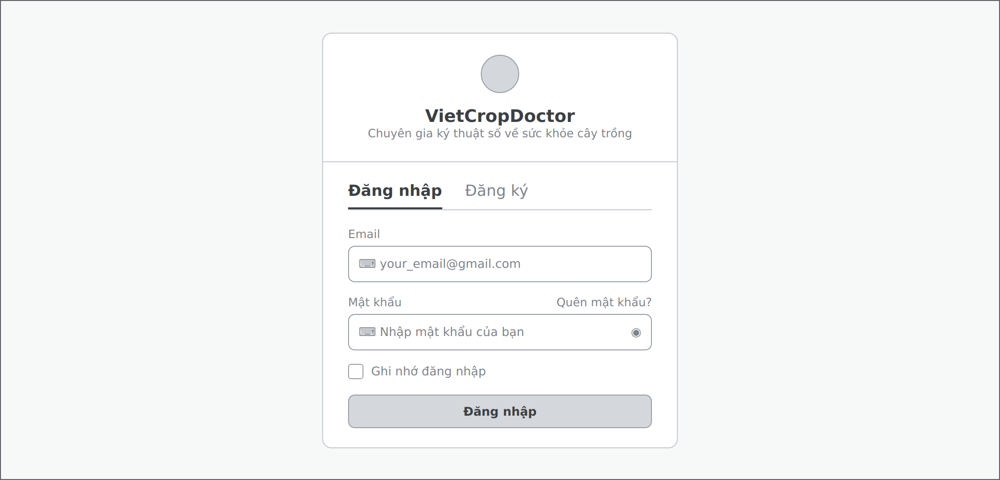<br/>Đăng nhập</td>
<td>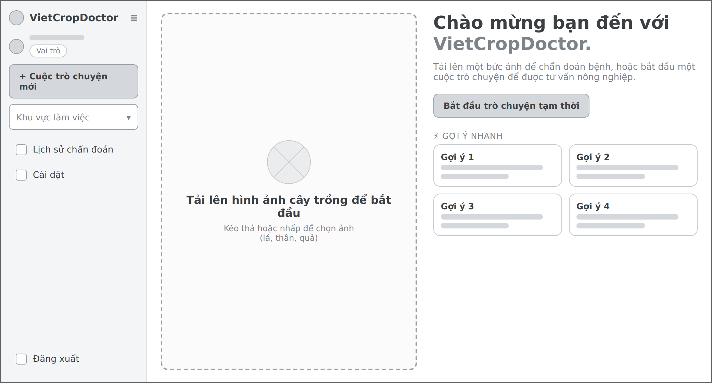<br/>Trang chủ</td>
</tr>
<tr>
<td>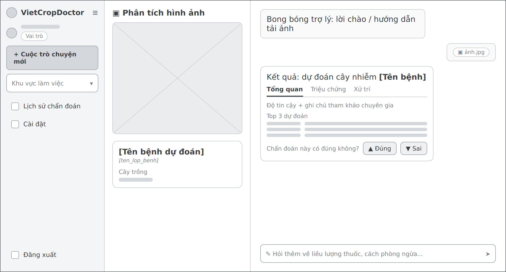<br/>Chẩn đoán</td>
<td>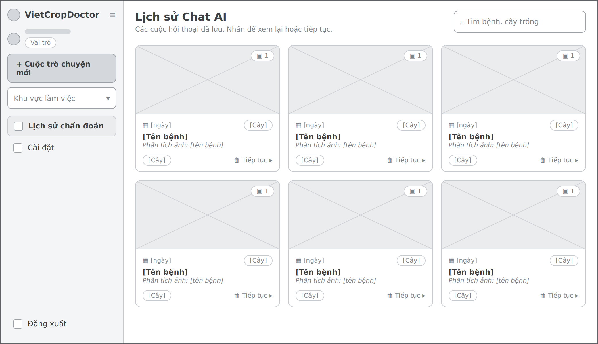<br/>Lịch sử</td>
</tr>
<tr>
<td>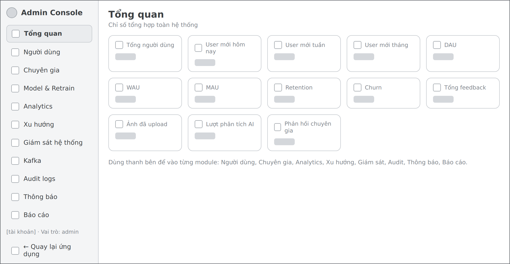<br/>Quản trị</td>
<td>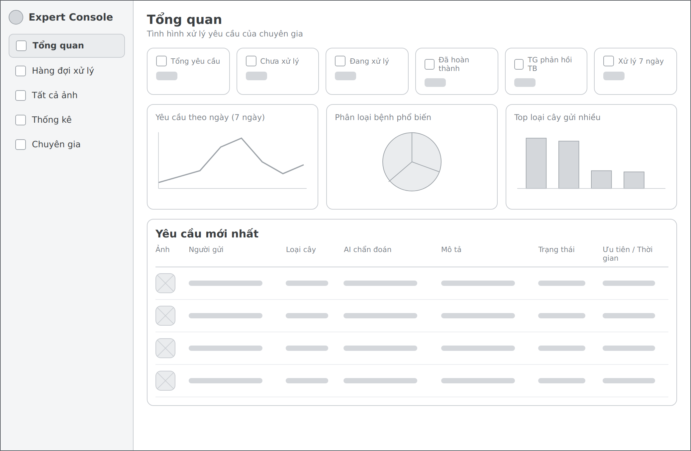<br/>Chuyên gia</td>
</tr>
</table>

---

## Trạng thái implement

| Service          | Trạng thái   | Ghi chú                              |
| ----------------- | -------------- | -------------------------------------- |
| Gateway (Nginx)   | Hoàn chỉnh     |                                       |
| Auth Service      | Hoàn chỉnh     | JWT + RBAC 3 cấp                     |
| Vision-AI         | Hoàn chỉnh     | Ensemble 5 model, MC Dropout, OOD    |
| RAG Engine        | Hoàn chỉnh     | Hybrid BM25 + dense, reranking       |
| Orchestrator      | Hoàn chỉnh     | 4-agent chain                        |
| Analytics         | Hoàn chỉnh     | Kafka → ClickHouse                   |
| ML Pipeline       | Hoàn chỉnh     | PySpark + PyTorch + MLflow + Airflow |
| React Web         | Hoàn chỉnh     | 7 trang                              |
| Knowledge base    | Cần ingest     | Chạy `ingest-knowledge.sh`           |
| Mobile app        | Ngoài scope    | Scaffold tồn tại, không implement    |
